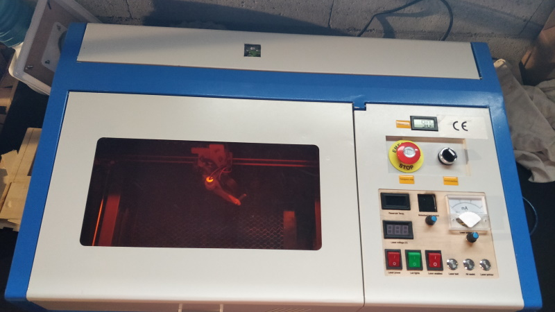

# K40 Laser

## Foreword

This is all about my K40 Laser improvements ...

Thanks goes to (Great French ressources) :

* Jean-Philippe Civade : <https://www.civade.com>
* Barbatronic : 

Youtube : <https://www.youtube.com/barbatroniclive>

Twitch : <https://www.twitch.tv/barbatroniclive>

Twitter : <https://twitter.com/barbatronic>

## General information / Caution / Rule of thumb / Recommandations

Details avalaible [here](using-k40-general-info/using-k40-laser-cutter.md)

## K40 - Legs/foot improvement

Details avalaible [here](custom-foot/foot-improvements.md)

## K40 - Custom motorized bed

WORK IN PROGRESS ... DOCUMENTATION BEING WRITTEN ... WORK IN PROGRESS ... 

Details avalaible [here](motorized-bed/motorized-bed-upgrade.md)

## K40 Upgrade power control

Details avalaible [here](control-panel/control-panel-upgrade.md)

## K40 - Air Assist

Details avalaible [here](air-assist/air-assist.md)

## K40 - Lens & Mirrors alignments and upgrade

TODO

## K40 - Setting proper laser focus

Details avalaible [here](laser-focus/setting-laser-focus.md)

## Bibliography / References

* [Great French references about K40 Laser Cutter - Github Barbatronic](https://github.com/nadarbreicq/Barbatronic/tree/master/laser%20k40)

Barbatronic's GitHub is full of DIY resources (robotic, PCD, FreeCAD, etc)

* [In French - General information - Blog de Iooner](https://iooner.io/k40-laser/)

* [Amélioration de la K40 - pointeur laser et Air Assist](https://www.youtube.com/watch?v=AwNY7BHcYXY)

* [K40 Tutorials / Ressources](https://k40.se/)

* [In French - Xmas ball](https://www.youtube.com/watch?v=sS2zOudljEQ)

* [In French - Améliorations / Hacking](https://www.civade.com/post/2020/08/23/D%C3%A9coupe-laser-CO2-K40-Am%C3%A9liorations-/-hacking-de-la-machine)
