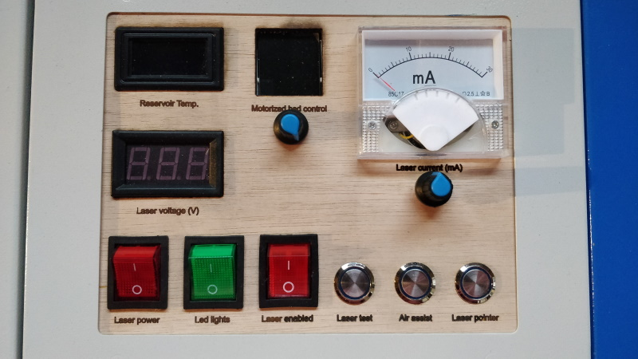

# K40 - Control panel upgrade

__!!! WORK IN PROGRESS ... DOCUMENTATION BEING WRITTEN ... WORK IN PROGRESS ... !!!__

Upgrade analog power setting
https://k40.se/k40-laser-upgrades/analog-power-setting/

## Bill of Materials

|                                                                                                                        Designation                                                                                                                        | Quantity | Price (euros) |
|:---------------------------------------------------------------------------------------------------------------------------------------------------------------------------------------------------------------------------------------------------------:|:--------:|:-------------:|
| [Blue Circle + fixed self-locking + China + 9-30V(12V) + 16mm](https://fr.aliexpress.com/item/4001291695467.html?spm=a2g0s.9042311.0.0.1fc66c37ERyqmR)                                                                                                    | 2        | 1.69          |
| [Blue Circle + Momentary self-reset + China + 9-30V(12V) + 16mm](https://www.aliexpress.com/item/12-16-19-22mm-Waterproof-Metal-Push-Button-Switch-LED-Light-Momentary-Latching-Car-Engine-Power/4001291695467.html?spm=a2g0s.9042311.0.0.1fc66c37ERyqmR) | 1        | 1.50          |

TODO : To be continued ...