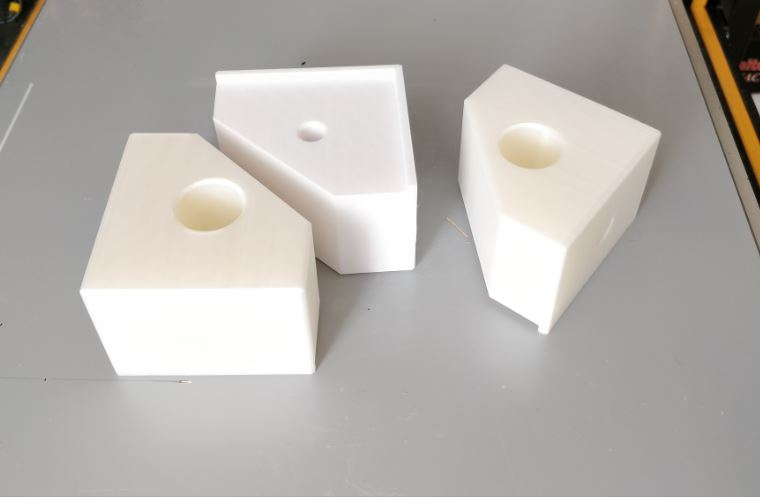
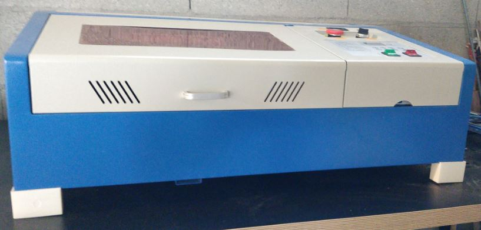

# K40 Laser - foot improvements

My K40 came with "roller foot /leg" (dunno the exact english translation). What on earth did they install roller foot on that device...in my opinion this is quite useless !

A french guy called `Barbatronic` designed simple cool standstill legs that can be 3D printed.

Here is the STL file link : <https://github.com/nadarbreicq/Barbatronic/tree/master/laser%20k40/pieds%20laser>

Even better he did a very nice video about this improvement (this guy is amazing!) : <https://www.youtube.com/watch?v=EUyNfkmQzwM&feature=youtu.be>

In the beginning, I wanted to design my own legs but eventually I used nice `Barbatronic` design !

Here is the result :

