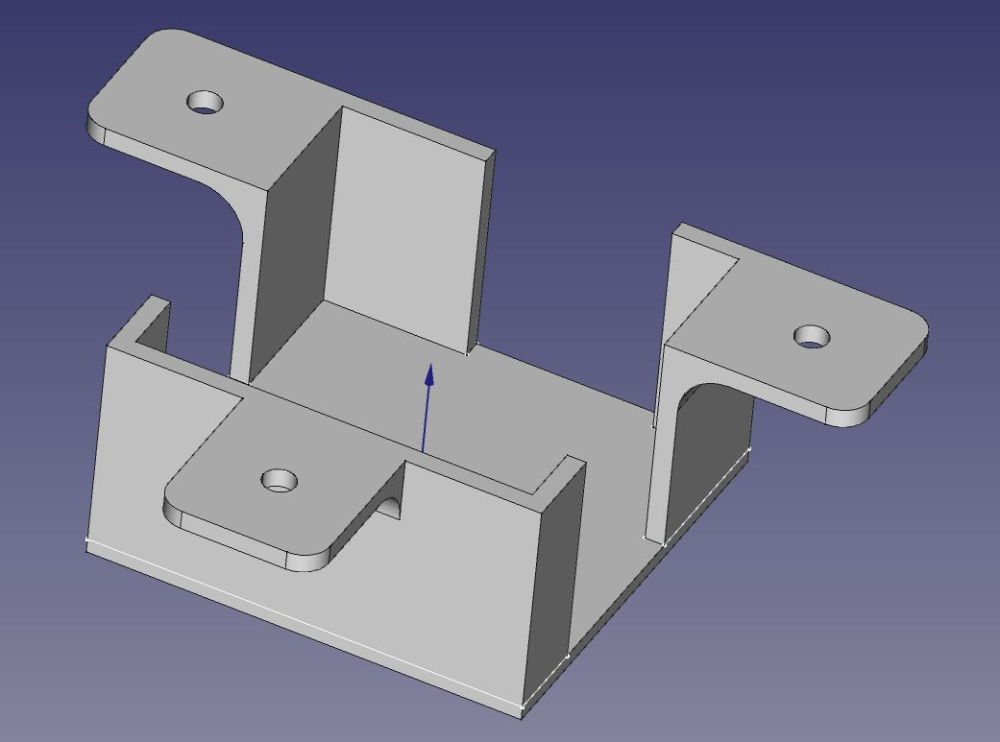

# Flowmeter holder

This is a flowmeter holder I realised with FreeCAD 2.0

It may be used to hold this kind of flowmeter, one can found on [Aliexpress](https://fr.aliexpress.com/item/32822267913.html?spm=a2g0o.9042311.0.0.1ec66c37fij9EE).

Dimension 40x40x25 mm

But mine is 40,4mm x 40,4mm x 21,6 mm

Feel free to download the

* [STL File](stl/flowmeter_holder.stl)
* [FreeCAD File](FreeCAD/flowmeter_holder.FCStd)