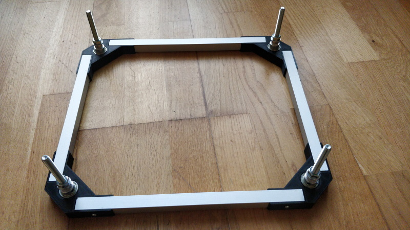
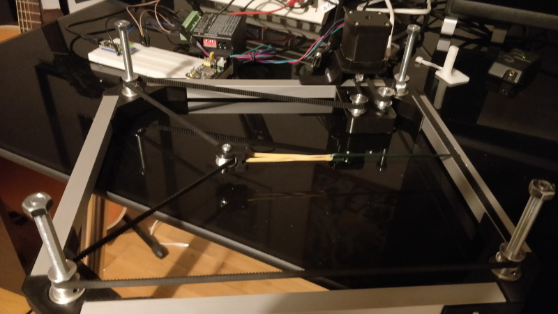
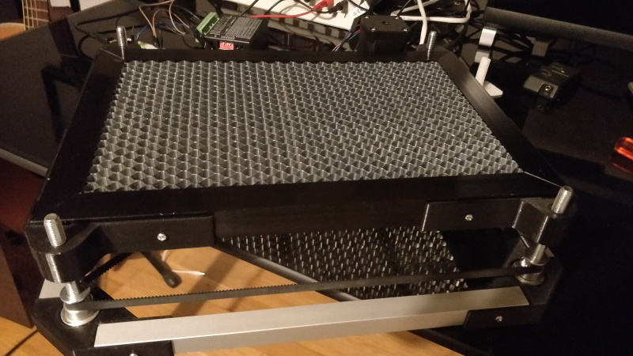
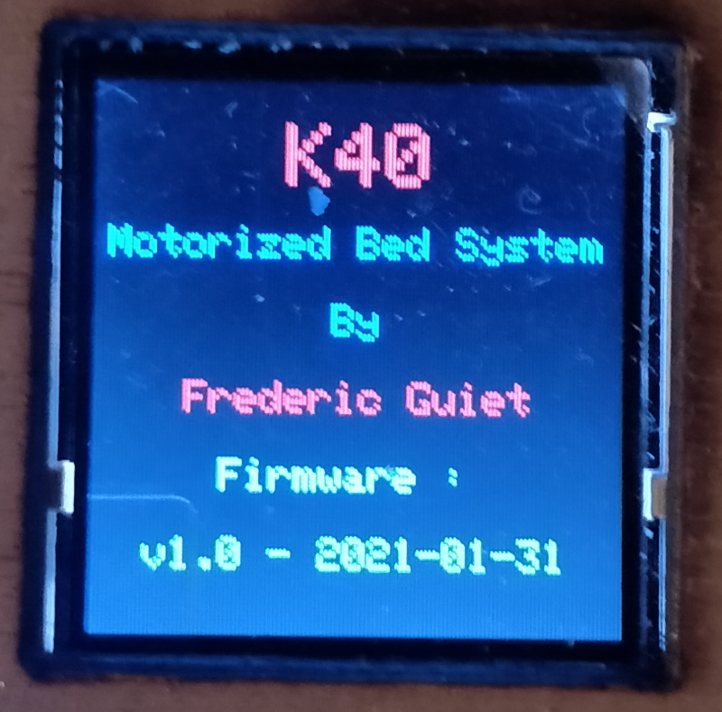
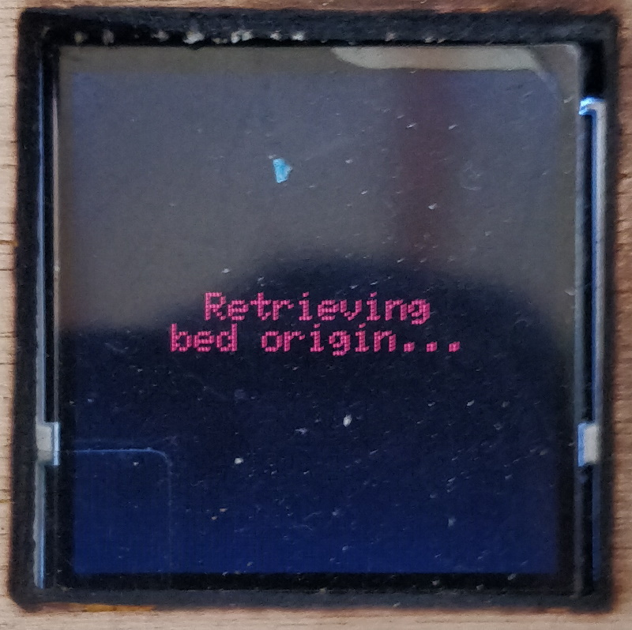
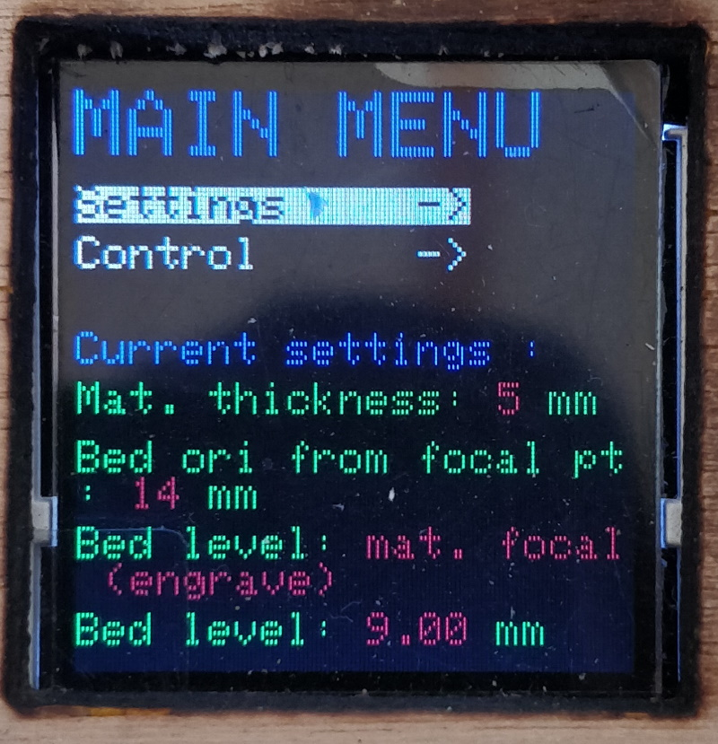
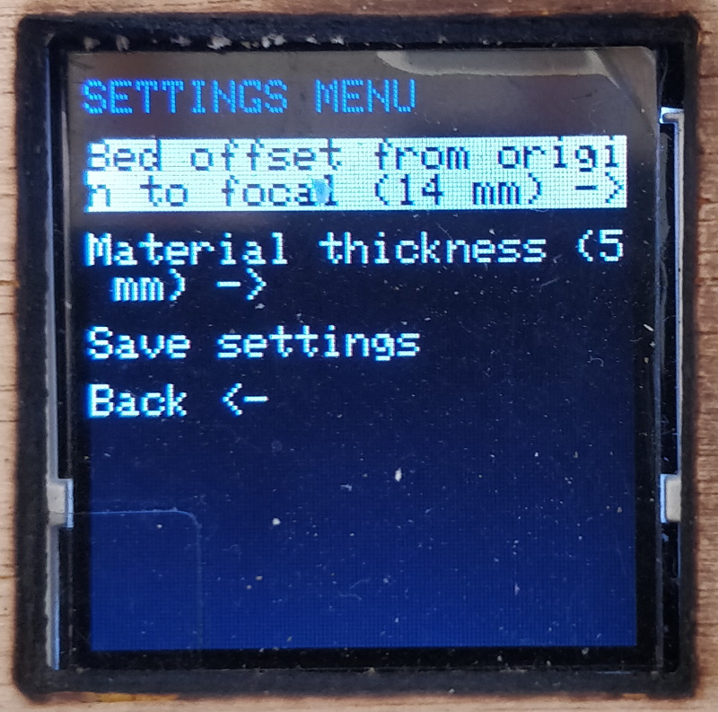
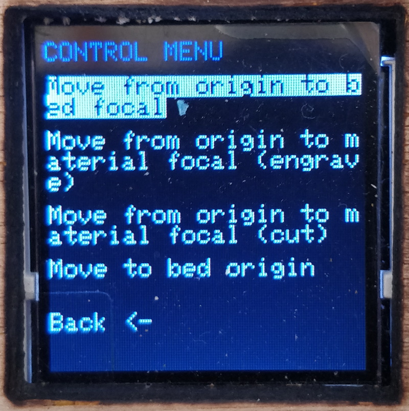

# K40 - Motorized bed upgrade

__!!! WORK IN PROGRESS ... DOCUMENTATION BEING WRITTEN ... WORK IN PROGRESS ... !!!__

Quick and dirty videos, I have made : 

* <https://youtu.be/IQfGlTcqH2U>

* <https://youtu.be/5MnR36rrxaM>

## Foreword

K40 Laser cutter comes with an awful useless bed so I decided to make my own motorized bed.

There are some resources on the Internet about how to realize a motorized bed for your K40 Laser cutter.

In particular, I was inspired by:

__mumpitz_82__ Youtube video : <https://www.youtube.com/watch?v=evmyce_BSfk>

__Tako Schotanus__ Youtube video : <https://www.youtube.com/watch?v=CWHxK8Uck-s>

But the best resources is from Jean-Philippe Civade : <https://www.civade.com> (it's in French though) :

<https://www.civade.com/post/2020/08/23/D%C3%A9coupe-laser-CO2-K40-:-R%C3%A9alisation-d-un-lit-motoris%C3%A9>

Everything is explained in details. Thanks for sharing !

## Making the motorized bed frame

Top view

Bottom view

With belt (final version does not have the belt tensioner. I am using 1250 mm that fits my design now)

With belt and bed (final version does not have the belt tensioner. I am using 1250 mm that fits my design now)

All 3D print parts needed are available here : <https://www.thingiverse.com/thing:4778552>

* 3D Print 4 corners : STL file `motorized-bed-base-corner-frame.stl`
* Cut 4 pieces of 15 x 15 mm aluminium tube (2 pieces of 26.1 cm lenght and 2 pieces of 22.2 cm lenght)
* Assemble the 3D print parts and the aluminium tubes
* Use a 2.5 mm drill bit to drill hole in the aluminium part
* Use a tap and die (Tarauds in French) M3 x 0.5mm 
* Use 8 x M3 bolt to tight the 3D Print part with the alumnium part
* Add the four 608ZZ bearings on the 3D Print parts
* Add the four M8 x 8mm bolts and nuts
* Add the four GT2 8mm (diameter) x 6 mm height pulleys 
* You're done !
* BONUS : Add 8 neodymes magnet (8mm x 1mm) of the bottom corner

## Bed level software

Software used to develop : Visual Studio Code + PlatformIO plugin.

Self-explanatory open source code, see folder : `sketches\k40-motorized-bed` on this GitHub.

* Using the bed level software

__Powering the K40 laser ON__

1. make the splash screen quickly appear
2. bed will retrieve its origin
3. bed will move up to the material focal point (engrave) level, that is to say : 

bed level to best laser focal length lens (should be around 50.8 mm) minus material thickness

Example in my case:

14 mm - 5 mm = 9 mm 

14 mm : distance of the bed from the bed origin so the laser focal distance from the bed is around 50.8 mm (default K40 focal length lens). See [Settings laser focus](../laser-focus/setting-laser-focus.md), to understand how I find my setting of 14 mm

5 mm : current material thickness (can be changed)

Splash screen

Bed retrieving its origin

__Main menu__

Main menu is made up of (to enter any menu, just hold the button for about half a second) :

1. Settings menu

When entering this menu, you will be able to set/change default material thickness, bed offset from origin to best focal lenght lens (See [Settings laser focus](../laser-focus/setting-laser-focus.md))

2. Control menu 

When entering this menu, you will be able to move the bed to different level (origin, engrave, cut)

3. Current settings values

This is a sum up of the current settings. 

Current material thickness

Current bed origin to best focal point distance. See [Settings laser focus](../laser-focus/setting-laser-focus.md)

Bed level status : engrave (= laser focal point minus material thickness), cut (= laser focal point minus material thickness / 2), origin, laser focal point (distance between bed and laser lenght should be around 50.8 mm)

Current bed level from origin (depends on bed status)

__Settings menu__

Here you can change defaults parameters and save them.

You can change :

The default distance between bed origin and the bed so the bed distance between bed and best focal length lens is around 50.8 mm (again see [Settings laser focus](../laser-focus/setting-laser-focus.md)). Use the menu `Bed offset from origin to focal (xx mm) ->`

The default material thickness. This setting is used to compute automatically the bed level used for engraving or for cutting. Use the menu `Material thickness (x mm) ->`

The following formulas are applied :

Bed level (cut) = bed level offset from origin to best focal point minus material thickness divided by 2
Bed level (engrave) = bed level offset from origin to best focal point minus material thickness

To change the value : hold the button for half a second then you will be able to change the value by turning the button clockwise or anti-clockwise

You can persist your settings by entering the `Save settings` menu

__Control menu__

With the control menu, you will be able freely change your bed level.

`Move from origin to focal (xx mm)` : make your bed go from bed origin to focal point ... quite obvious...the distance can be set using `Settings menu`

`Move from origin to material focal (engrave)` : make your bed go from bed origin to focal point minus material thickness

`Move from origin to material focal (cut)` : make your bed go from bed origin to focal point minus material thickness divided by 2

`Move to bed origin` : make your bed go to the bed origin (lowest point the bed can go). Maybe useful if you want to pull your bed out of your K40.

## Electronic datasheet

TODO : __!!! WORK IN PROGRESS ... DOCUMENTATION BEING WRITTEN ... WORK IN PROGRESS ... !!!__

## BOM (Bill of materials)

| Designation                                                                                                                                                                                                                                                                                                                                       | Quantity | Price (euros) |
|---------------------------------------------------------------------------------------------------------------------------------------------------------------------------------------------------------------------------------------------------------------------------------------------------------------------------------------------------|----------|---------------|
| [Neodyme magnet 8mm x 1mm](https://fr.aliexpress.com/item/1005001485065704.html?spm=a2g0o.productlist.0.0.25674670G505Yw&algo_pvid=8e590427-5b37-46f8-9b7d-35950906bf52&algo_expid=8e590427-5b37-46f8-9b7d-35950906bf52-1&btsid=0b0a187b16145338740781053e6306&ws_ab_test=searchweb0_0,searchweb201602_,searchweb201603_)                         | 10       | 1.6           |
| [Roulement 608ZZ](https://www.amazon.fr/gp/product/B07RZ651J7/ref=ppx_yo_dt_b_search_asin_title?ie=UTF8&psc=1)                                                                                                                                                                                                                                    | 1        | 10            |
| [Module LCD TFT couleur SPI 1.44 pouces série 128x128](https://fr.aliexpress.com/item/32805710090.html?spm=a2g0o.productlist.0.0.3d7f1d29woOsDt&algo_pvid=4743a9a4-b74f-449a-873f-ef37a87d4dc8&algo_expid=4743a9a4-b74f-449a-873f-ef37a87d4dc8-12&btsid=0b0a187b16145341090693280e6306&ws_ab_test=searchweb0_0,searchweb201602_,searchweb201603_) | 1        | 2.36          |
| [Power supply : 12v, 3A](https://fr.aliexpress.com/item/32983648084.html?spm=a2g0s.9042311.0.0.27426c379UWNDo)                                                                                                                                                                                                                                    | 1        | 5.47          |
| [Module d'encodeur rotatif 360 degrés](https://fr.aliexpress.com/item/32648520888.html?spm=a2g0s.9042311.0.0.1ec66c37pUfP6L)                                                                                                                                                                                                                      | 1        | 0.67          |
| [Arduino Uno](https://fr.aliexpress.com/item/32272099710.html?spm=a2g0o.productlist.0.0.175e3738xCRVQC&algo_pvid=792f52bf-9a79-4d4b-aeee-199bcc69d8aa&algo_expid=792f52bf-9a79-4d4b-aeee-199bcc69d8aa-2&btsid=0b0a187b16145346123117133e6306&ws_ab_test=searchweb0_0,searchweb201602_,searchweb201603_)                                           | 1        | 2.86          |
| M3 Bolt                                                                                                                                                                                                                                                                                                                                           | 8        | ?             |
| Bolt M8 x 80mm                                                                                                                                                                                                                                                                                                                                    | 4        | ?             |
| Nut M8                                                                                                                                                                                                                                                                                                                                            | 4        | ?             |
| [End stop switch](https://fr.aliexpress.com/item/32824972155.html?spm=a2g0s.9042311.0.0.27426c37mAJldV)                                                                                                                                                                                                                                           | 1        | 0.59          |
| [GT2 Belt 1250 mm](https://fr.aliexpress.com/item/4000307078477.html?spm=a2g0s.9042311.0.0.70226c377k5Fyv)                                                                                                                                                                                                                                        | 1        | 1.76          |
| [Entretoise](https://www.amazon.fr/gp/product/B07RP6CRD5/ref=ppx_yo_dt_b_asin_title_o01_s00?ie=UTF8&psc=1)                                                                                                                                                                                                                                        | 1        | 15            |
| [Stepper Driver Motor TB6600](https://www.amazon.fr/gp/product/B0811GSPJK/ref=ppx_yo_dt_b_asin_title_o04_s00?ie=UTF8&psc=1)                                                                                                                                                                                                                       | 1        | 13.49         |
| [Tube carré - aluminium, couleur argent, anodisée, 1000 x 15 x 15 mm](https://www.amazon.fr/gp/product/B0029ZTDKM/ref=ppx_od_dt_b_asin_title_s00?ie=UTF8&psc=1)                                                                                                                                                                                   | 3        | 8.36          |
| [DollaTek 5PCS Aluminium GT2 Courroie De Distribution Poulie 20 Dents Alésage 8mm Largeur 6mm et Clé pour RepRap 3D Imprimante Prusa i3](https://www.amazon.fr/gp/product/B07DK1J8ZD/ref=ppx_yo_dt_b_asin_title_o09_s01?ie=UTF8&psc=1)                                                                                                            | 1        | 8             |
| [Quimat 3x Nema 17 Stepper Moteur,Moteurs pour Imprimante 3D 1.7A 0.59Nm](https://www.amazon.fr/gp/product/B06XQWMDWT/ref=ppx_yo_dt_b_asin_title_o09_s02?ie=UTF8&psc=1)                                                                                                                                                                           | 1        | 40            |
| [Table de travail en nid d'abeille pour graveur Laser CO2, pièces pour Machine de découpe Shenhui SH K40 graveur de timbres 320x220mm](https://fr.aliexpress.com/item/32603523206.html?spm=a2g0s.9042311.0.0.27426c37F8tu4Z)                                                                                                                      | 1        | 13.96         |
