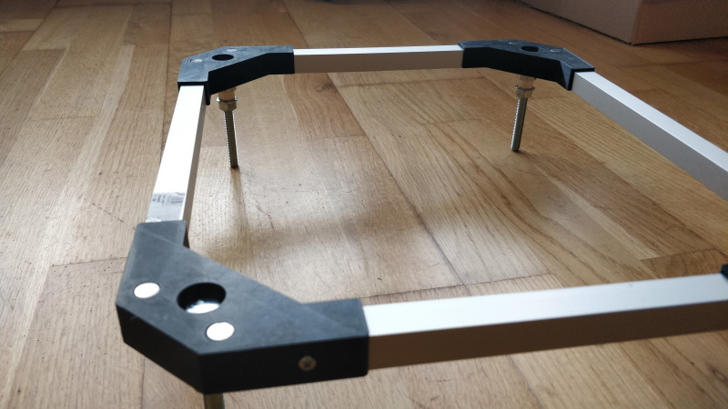

# K40 - Motorized bed upgrade

## Foreword

K40 Laser cutter comes with an awful useless bed so I decided to make my own motorized bed.

There are some resources on the Internet about how to realize a motorized bed for your K40 Laser cutter.

In particular, I was inspired by:

__mumpitz_82__ Youtube video : <https://www.youtube.com/watch?v=evmyce_BSfk>

__Tako Schotanus__ Youtube video : <https://www.youtube.com/watch?v=CWHxK8Uck-s>

But the best resources is from Jean-Philippe Civade : <https://www.civade.com> (it's in French though) :

<https://www.civade.com/post/2020/08/23/D%C3%A9coupe-laser-CO2-K40-:-R%C3%A9alisation-d-un-lit-motoris%C3%A9>

Everything is explained in details. Thanks for sharing !

## Making the motorized bed frame

Top view

Bottom view

All 3D print parts needed are available here : <https://www.thingiverse.com/thing:4778552>

* 3D Print 4 corners : STL file `motorized-bed-base-corner-frame.stl`
* Cut 4 pieces of 15 x 15 mm aluminium tube (2 pieces of 26.1 mm lenght and 2 pieces of 22.2 mm lenght)
* Assemble the 3D print parts and the aluminium tubes
* Use a 2.5 mm drill bit to drill hole in the aluminium part
* Use a tap and die (Tarauds in French) M3 x 0.5mm 
* Use 8 x M3 bolt to tight the 3D Print part with the alumnium part
* Add the four 608ZZ bearings on the 3D Print parts
* Add the four M8 x 8mm bolts and nuts
* Add the four GT2 8mm (diameter) x 6 mm height pulleys 
* You're done !
* Add 8 neodymes magnet (8mm x 1mm) of the bottom corner

## Bed level software

Software used : 

* Visual Studio Code + PlatformIO plugin

Self-explanatory open source code, see folder here : `sketches\k40-motorized-bed`

## BOM (Bill of materials)

| Designation                                                                                                                                                                                                                            | Quantity | Price (euros) |
|----------------------------------------------------------------------------------------------------------------------------------------------------------------------------------------------------------------------------------------|----------|---------------|
| [Roulement 608ZZ](https://www.amazon.fr/gp/product/B07RZ651J7/ref=ppx_yo_dt_b_search_asin_title?ie=UTF8&psc=1)                                                                                                                         | 1        | 10            |
| [Power supply : 12v, 3A](https://fr.aliexpress.com/item/32983648084.html?spm=a2g0s.9042311.0.0.27426c379UWNDo)                                                                                                                         | 1        | 5.47          |
| Bolt M8 x 80mm                                                                                                                                                                                                                         | 4        | ?             |
| Nut M8                                                                                                                                                                                                                                 | 4        | ?             |
| [End stop switch](https://fr.aliexpress.com/item/32824972155.html?spm=a2g0s.9042311.0.0.27426c37mAJldV)                                                                                                                                | 1        | 0.59          |
| [GT2 Belt 1250 mm](https://fr.aliexpress.com/item/4000307078477.html?spm=a2g0s.9042311.0.0.70226c377k5Fyv)                                                                                                                             | 1        | 1.76          |
| [Entretoise](https://www.amazon.fr/gp/product/B07RP6CRD5/ref=ppx_yo_dt_b_asin_title_o01_s00?ie=UTF8&psc=1)                                                                                                                             | 1        | 15            |
| [Stepper Driver Motor TB6600](https://www.amazon.fr/gp/product/B0811GSPJK/ref=ppx_yo_dt_b_asin_title_o04_s00?ie=UTF8&psc=1)                                                                                                            | 1        | 13.49         |
| [Tube carré - aluminium, couleur argent, anodisée, 1000 x 15 x 15 mm](https://www.amazon.fr/gp/product/B0029ZTDKM/ref=ppx_od_dt_b_asin_title_s00?ie=UTF8&psc=1)                                                                        | 3        | 8.36          |
| [DollaTek 5PCS Aluminium GT2 Courroie De Distribution Poulie 20 Dents Alésage 8mm Largeur 6mm et Clé pour RepRap 3D Imprimante Prusa i3](https://www.amazon.fr/gp/product/B07DK1J8ZD/ref=ppx_yo_dt_b_asin_title_o09_s01?ie=UTF8&psc=1) | 1        | 8             |
| [Quimat 3x Nema 17 Stepper Moteur,Moteurs pour Imprimante 3D 1.7A 0.59Nm](https://www.amazon.fr/gp/product/B06XQWMDWT/ref=ppx_yo_dt_b_asin_title_o09_s02?ie=UTF8&psc=1)                                                                | 1        | 40            |
| [Table de travail en nid d'abeille pour graveur Laser CO2, pièces pour Machine de découpe Shenhui SH K40 graveur de timbres 320x220mm](https://fr.aliexpress.com/item/32603523206.html?spm=a2g0s.9042311.0.0.27426c37F8tu4Z)           | 1        | 13.96         |

